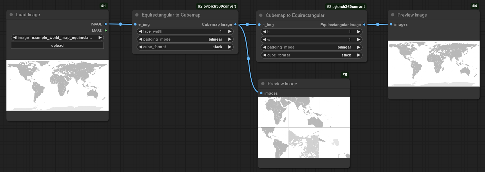

# 📷 PyTorch 360° Image Conversion Toolkit for ComfyUI

## Overview

This project implements the functions from [pytorch360convert](https://github.com/ProGamerGov/pytorch360convert) as custom [ComfyUI](https://github.com/comfyanonymous/ComfyUI) nodes, along with a few additional useful functions for working with equirectangular 360 images and cubemaps.

The pytorch360convert library provides powerful and differentiable image transformation utilities for converting between different panoramic image formats like Equirectangular (360°) Images, Cubemap Representations, and Perspective Projections.

| E2C -> C2E | E2C -> Split -> Rebuild -> C2E |
| :---: | :----: |
|  |  |


## 🔧 Requirements

- [pytorch360convert](https://github.com/ProGamerGov/pytorch360convert)


## 📦 Installation

If the provided installation information below is not enough, then please see here for more details on installing custom ComfyUI nodes: https://www.comflowy.com/advanced/how-to-install-comfyui-extension

### ComfyUI Manager install

If [ComfyUI-Manager](https://github.com/ltdrdata/ComfyUI-Manager) is installed, then you can download via pasting in the github link to this repo, or via the built-in install menu.

### Installation for portable ComfyUI

#### Basic install

Download this repo as a zip file and then unzip it inside the ComfyUI custom_nodes directory. 

Then install the dependency:

```
python -m pip install pytorch360convert
```

#### git install

If using Windows, you can install git from here: https://git-scm.com/download/win if you have not done so already and wish to use Git. Then navigate to the custom nodes directory and then run:

```
git clone https://github.com/ProGamerGov/ComfyUI_pytorch360convert --recursive
```

Then install the dependency for Linux and MacOS:

```
python -m pip install pytorch360convert
```

Or for Windows:

```
path/to/python.exe -m pip install pytorch360convert
```

#### ComfyUI registry install

```
comfy node registry-install comfyui-pytorch360convert
```


## 💡 Usage Examples

See the provided workflow files in the `examples` directory for examples of how to use each new node.


## 📚 Nodes

The custom nodes added by this project are available under the 'pytorch360convert' heading in the node selection tab.

### Equirectangular to Cubemap (E2C)

The E2C node converts equirectangular images into cubemaps. For more information see the pytorch360convert repo [here](https://github.com/ProGamerGov/pytorch360convert?tab=readme-ov-file#-basic-functions).

### Cubemap to Equirectangular (C2E)

The C2E node converts cubemaps into equirectangular images. For more information see the pytorch360convert repo [here](https://github.com/ProGamerGov/pytorch360convert?tab=readme-ov-file#-basic-functions).

### Equirectangular to Perspective (E2P)

The E2P node converts equirectangular images into perspective images. For more information see the pytorch360convert repo [here](https://github.com/ProGamerGov/pytorch360convert?tab=readme-ov-file#-basic-functions).

### Equirectangular to Equirectangular (E2E)

The E2E node rotates an equirectangular image along one or more axes (roll, pitch, and yaw) to produce a horizontal shift, vertical shift, or to roll the image. For more information see the pytorch360convert repo [here](https://github.com/ProGamerGov/pytorch360convert?tab=readme-ov-file#-basic-functions).

### Roll Image Axes

The Roll Image node rolls an image along the height dimension (y axis) or the width dimension (x axis). This can help make artifacts like seams more accessible. Note that y axis rotations are not correct for final equirectangular outputs. Use the E2E node instead for y axis rotations.

### Crop Image with Coords & Paste Image with Coords

These two nodes allow you to crop a section of an image out to make things like in-painting faster and more memory efficient, before pasting the cropped section back into the original image.

By default, the cropping node center crops images according to the provided crop_h and crop_w values. If crop_h2 and crop_w2 are used, then the image will be cropped according to `[..., crop_h:crop_h2, crop_w:crop_w2, ...]`.

### Masked Diff C2E

This is an experimental node for only pasting the modified parts of face images to the original equirectangular image. This is meant to help lessen the loss of image quality caused by converting between equirectangular and cubemap formats.

### Pad 180 to 360 Equirectangular

This node pads a given 180 degree equirectangular image, so that it becomes a 360 degree equirectangular image.

### Crop 360 to 180 Equirectangular

This node crops a 360 degree equirectangular image into a 180 degree equirectangular image.

### Crop Stereo to Monoscopic

This node allows you to horizontally or vertically crop a 360 degree equirectangular image that is in stereo format or 3D format, into two separate monoscopic images.

### Merge Monoscopic into Stereo

This node allows you to combine two separate monoscopic 360 degree images into a single stereo or 3D image.

### Apply Circular Padding Model

This node allows you to apply circular padding to the x-axis of all Conv2d layers in a model. This can help with reducing the seam where the left and right sides of the image connect.

### Apply Circular Padding VAE

This node allows you to apply circular padding to the x-axis of all the Conv2d layers in a VAE. This can help with reducing the seam where the left and right sides of the image connect.

### Panorama Viewer

For viewing 360 images inside ComfyUI, see the [github.com/ProGamerGov/ComfyUI_preview360panorama](https://github.com/ProGamerGov/ComfyUI_preview360panorama) custom node.


## 🤝 Contributing

Contributions are welcome! Please feel free to submit a Pull Request.


## 🔬 Citation

If you use this library in your research or project, please refer to the included [CITATION.cff](CITATION.cff) file or cite it as follows:

### BibTeX
```bibtex
@misc{egan2024pytorch360convert,
  title={PyTorch 360° Image Conversion Toolkit},
  author={Egan, Ben},
  year={2024},
  publisher={GitHub},
  howpublished={\url{https://github.com/ProGamerGov/pytorch360convert}}
}
```

### APA Style
```
Egan, B. (2024). PyTorch 360° Image Conversion Toolkit [Computer software]. GitHub. https://github.com/ProGamerGov/pytorch360convert
```
